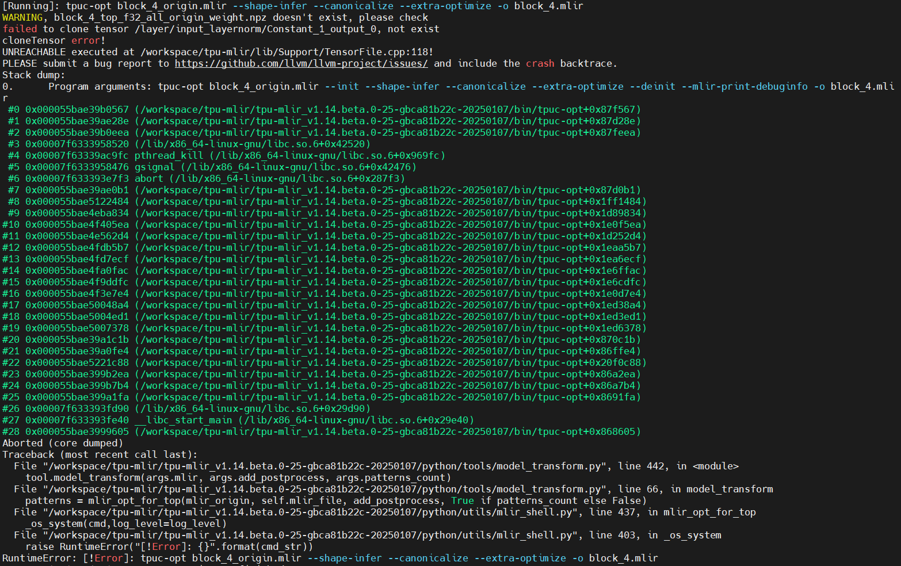
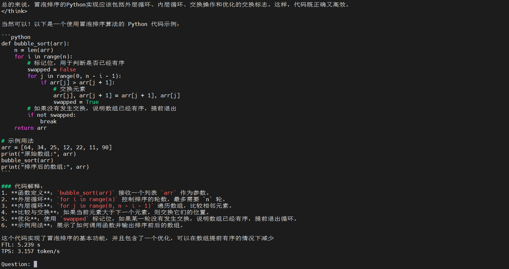

# 编译并运行deepseek-r1-distill-qwen-32b-2dev bmodel

目标：算能官方未提供使用TPU运行的deepseek-r1-distill-qwen-32b双芯模型，本次针对该模型，尝试导出onnx模型、使用TPU-MLIR编译得到bmodel，并尝试运行

## 环境说明

* x86主机docker容器中进行
* TPU-MLIR: v1.14.beta.0
* 内存占用：200GB以上（推荐256GB）
* 存储需求：700GB以上（默认）

## 操作步骤

### TPU-MLIR环境搭建

#### 下载并解压TPU-MLIR

从sftp上获取TPU-MLIR压缩包

```sh
cd /workspace
pip3 install dfss --upgrade
#1684X导出Deepseek-R1-Distill-Qwen专用
python3 -m dfss --url=open@sophgo.com:sophon-demo/Qwen/tpu-mlir_v1.14.beta.0-25-gbca81b22c-20250107.tar.gz
tar -xf tpu-mlir_v1.14.beta.0-25-gbca81b22c-20250107.tar.gz
```

### 获取onnx

#### 下载模型

```sh
git clone https://github.com/sophgo/sophon-demo.git
cd sophon-demo/sample/Qwen
```

注：

* Deepseek-R1-Distill-Qwen-32B官方库62G左右，在下载之前，要确认自己有huggingface官网的access token或者SSH key。

```sh
git lfs install
git clone https://huggingface.co/deepseek-ai/DeepSeek-R1-Distill-Qwen-32B
```

如果git clone完代码之后出现卡住，可以尝试ctrl+c中断，然后进入仓库运行git lfs pull。

推荐采用以下方式下载

```sh
pip install modelscope
modelscope download --model deepseek-ai/DeepSeek-R1-Distill-Qwen-32B --local_dir DeepSeek-R1-Distill-Qwen-32B
```

#### 修改官方代码

本例程的`tools`目录下提供了修改好之后的`modeling_qwen.py`。可以直接替换掉原仓库的文件：

Deepseek-R1-Distill-Qwen-32B

推荐使用虚拟环境从而避免转换其他模型时依赖冲突

```sh
mkdir envs && cd envs
python -m venv --system-site-packages deepseek-r1
source deepseek-r1/bin/activate
cd ..
```

安装依赖并替换文件

```sh
pip install transformers_stream_generator einops tiktoken accelerate torch==2.0.1+cpu torchvision==0.15.2 transformers==4.45.2
cp tools/DeepSeek_R1_Distill_Qwen2.5-1.5B-Instruct/modeling_qwen2.py /workspace/sophon-demo/sample/Qwen/envs/deepseek-r1/lib/python3.10/site-packages/transformers/models/qwen2/
```

* PS: 此处修改了transformers包所在位置，建议替换前先pip show transformers查看一下路径

#### 导出onnx

克隆LLM-TPU

```sh
git clone https://github.com/sophgo/LLM-TPU.git
cd LLM-TPU/models/Qwen2_5/compile
```

导出onnx

```sh
python export_onnx.py -m /workspace/sophon-demo/sample/Qwen/DeepSeek-R1-Distill-Qwen-32B/ --seq_length 8192 --lmhead_with_topk 1
```

导出后的onnx文件在./tmp/onnx目录下

#### 编译bmodel

首先需要在mlir工具下激活环境

```sh
cd tpu-mlir_v1.14.beta.0-25-gbca81b22c-20250107
source envsetup.sh
```

开始编译双芯模型

```sh
./compile.sh --mode int4 --num_device 2 --name deepseek-r1-32b --addr_mode io_alone --seq_length 8192 --dynamic 0
```

遇到部分模块编译失败问题



考虑是由于进程数量太多导致有些编译进程被杀死，适当增大代码中的等待时间后编译失败的模块明显变少，最终将编译改为串行执行保证能运行成功，修改后的代码：[compile.sh](./assets/compile.sh)


成功编译出bmodel

### 运行模型

尝试运行32b双芯模型，首先将编译的bmodel复制到TPU所在机器

```sh
git clone https://github.com/sophgo/LLM-TPU.git
cd LLM-TPU/models/Qwen2_5/python_demo_parallel
```

编译c++依赖

```sh
mkdir build
cd build && cmake .. && make -j8 && cp *cpython* .. && cd ..
```

运行双芯模型

```sh
python pipeline.py --model_path ./deepseek-r1-32b_int4_seq8192_2dev.bmodel --tokenizer_path ../support/token_config/ --devid 0,1
```

运行失败，原因是TPU内存不足


尝试将序列长度降低到1024重新编译生成模型后，再次运行发现能够运行成功但是会一直重复，需要替换token_config，使用 [编译运行deepseek-r1-32b双芯模型](./build_run_deepseek-r1-distill-qwen-32b_bmodel_guide.md) 模型导出方式产生的tokenizer目录可正常运行

```sh
python pipeline.py --model_path ./deepseek-r1-32b_int4_seq8192_2dev.bmodel --tokenizer_path ./tokenizer/ --devid 0,1
```

运行结果


尝试进行代码生成



## 参考资料

* [sophon-demo: Qwen模型导出与编译](https://github.com/sophgo/sophon-demo/blob/release/sample/Qwen/docs/Qwen_Export_Guide.md)
* [LLM-TPU: Qwen2.5多芯demo](https://github.com/sophgo/LLM-TPU/tree/main/models/Qwen2_5/python_demo_parallel)
