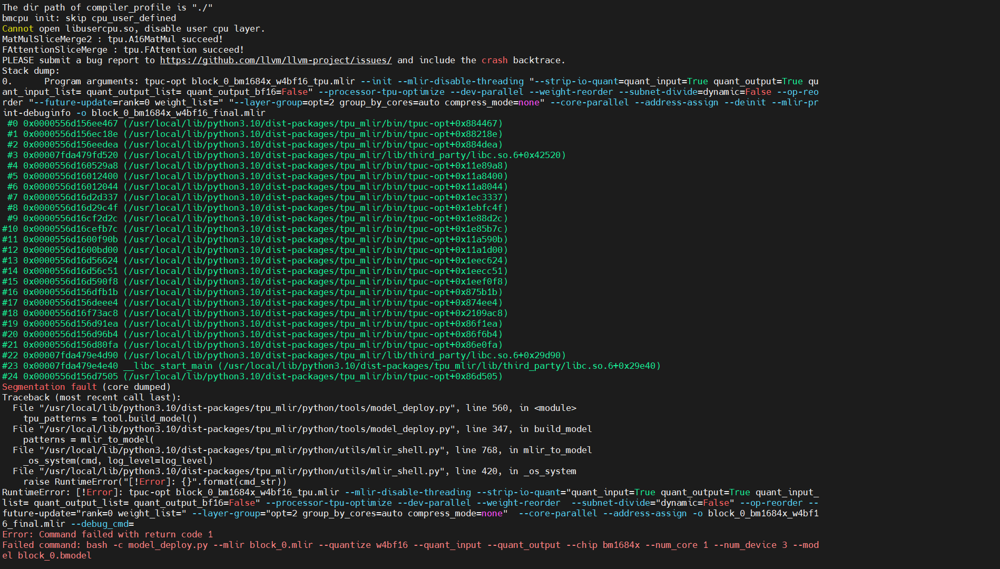
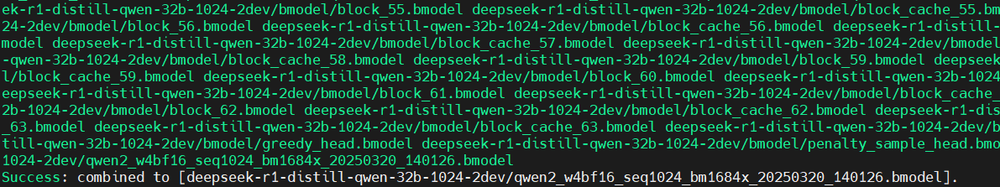
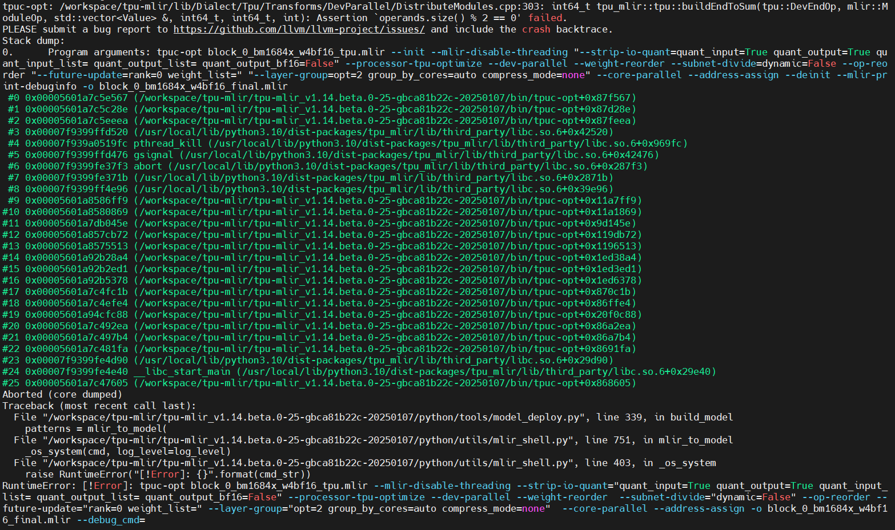
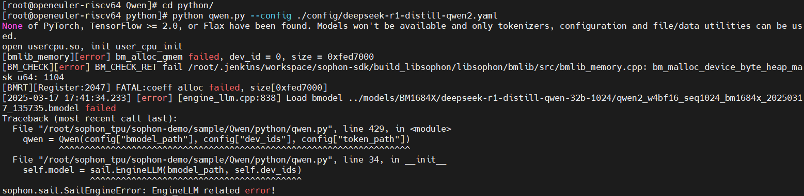
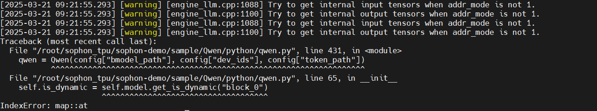
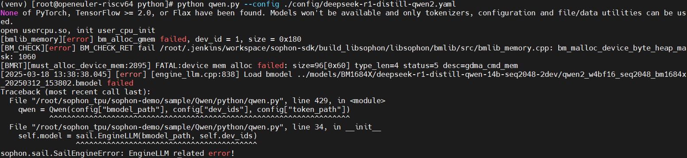

# 编译并运行deepseek-r1-distill-qwen-32b bmodel

目标：算能官方未尝试使用TPU运行deepseek-r1-distill-qwen-32b推理，本次针对该模型，尝试导出onnx模型、使用TPU-MLIR编译得到bmodel，并尝试运行

## 环境说明

* x86主机docker容器中进行
* AI编译器：TPU-MLIR
* 内存占用：200GB以上（推荐256GB）
* 存储需求：700GB以上（默认，处理后需280GB）

## 操作步骤

### TPU-MLIR环境搭建

#### 下载并解压TPU-MLIR

从sftp上获取TPU-MLIR压缩包

```sh
cd /workspace
pip3 install dfss --upgrade
#1684X导出Deepseek-R1-Distill-Qwen专用
python3 -m dfss --url=open@sophgo.com:sophon-demo/Qwen/tpu-mlir_v1.14.beta.0-25-gbca81b22c-20250107.tar.gz
tar -xf tpu-mlir_v1.14.beta.0-25-gbca81b22c-20250107.tar.gz
```

### 获取onnx

#### 下载模型

```sh
git clone https://github.com/sophgo/sophon-demo.git
cd sophon-demo/sample/Qwen
```

注：

* Deepseek-R1-Distill-Qwen-32B官方库62G左右，在下载之前，要确认自己有huggingface官网的access token或者SSH key。

```sh
git lfs install
git clone https://huggingface.co/deepseek-ai/DeepSeek-R1-Distill-Qwen-32B
```

如果git clone完代码之后出现卡住，可以尝试ctrl+c中断，然后进入仓库运行git lfs pull。

推荐采用以下方式下载

```sh
pip install modelscope
modelscope download --model deepseek-ai/DeepSeek-R1-Distill-Qwen-32B --local_dir DeepSeek-R1-Distill-Qwen-32B
```

#### 修改官方代码

本例程的`tools`目录下提供了修改好之后的`modeling_qwen.py`。可以直接替换掉原仓库的文件：

Deepseek-R1-Distill-Qwen-32B

推荐使用虚拟环境从而避免转换其他模型时依赖冲突

```sh
mkdir envs && cd envs
python -m venv --system-site-packages deepseek-r1
source deepseek-r1/bin/activate
cd ..
```

安装依赖并替换文件

```sh
pip install transformers_stream_generator einops tiktoken accelerate torch==2.0.1+cpu torchvision==0.15.2 transformers==4.45.2
cp tools/DeepSeek_R1_Distill_Qwen2.5-1.5B-Instruct/modeling_qwen2.py /workspace/sophon-demo/sample/Qwen/envs/deepseek-r1/lib/python3.10/site-packages/transformers/models/qwen2/
```

* PS: 此处修改了transformers包所在位置，建议替换前先pip show transformers查看一下路径

### 编译bmodel

#### 单芯模型

为 BM1684X 编译 Deepseek-R1-Distill-Qwen bmodel

```sh
# bm1684x 单芯
# 请注意1684X导出Deepseek-R1-Distill-Qwen bmodel仅需要运行该脚本，无需转onnx，请使用专用版本tpu-mlir
python tools/model_export_BM1684X_DS_qwen.py --quantize w4bf16 --tpu_mlir_path /workspace/tpu-mlir/tpu-mlir_v1.14.beta.0-25-gbca81b22c-20250107 --torch_path ./DeepSeek-R1-Distill-Qwen-32B --seq_length 1024  --out_dir deepseek-r1-distill-qwen-32b-1024
```

其中，tpu_mlir_path指定tpu-mlir地址，torch_path指定下载模型位置，seq_length也可指定为8192，编译成功之后，BM1684X模型将会存放在out_dir指定目录下，该目录下还会存在onnx和bmodel两个中间文件夹可以删除。

以下方案能避免可能出现的编译失败问题：

* 过程中由于临时onnx文件占用存储过大，参考下节修改代码（处理之后331GB存储空间可以成功编译出模型）
* 如果实在内存不够可以在编译时指定max_workers为1，默认为3

#### 双芯模型

尝试编译双芯模型

```sh
# bm1684x 双芯
python tools/model_export_BM1684X_DS_qwen.py --quantize w4bf16 --tpu_mlir_path /workspace/tpu-mlir/tpu-mlir_v1.14.beta.0-25-gbca81b22c-20250107 --torch_path ./DeepSeek-R1-Distill-Qwen-32B --seq_length 1024  --out_dir deepseek-r1-distill-qwen-32b-1024-2dev --num_device 2
```

编译失败，出现以下问题



问题原因是使用的TPU-MLIR版本不对，实际没有使用所指定的特定版本，后续对其进行修改可成功编译，修改后的代码：[model_export_BM1684X_DS_qwen.py](./assets/model_export_BM1684X_DS_qwen.py)



双芯模型编译成功

#### 三芯模型

尝试编译三芯模型



三芯编译失败，通常都是编译单芯或偶数个芯片

#### 空间释放

在`tools/model_export_BM1684X_DS_qwen.py`的BmodelConverter类的compile_lm_head、compile_greedy_head、compile_penalty_head、compile_block和compile_block_cache函数中在转换mlir后删除对应onnx文件，如下：

```python
    self.run_command(['bash', '-c', ' '.join(transform_args)], env)
    self.run_command(['bash', '-c', ' '.join(deploy_args)], env)
+   self.run_command(['rm', '-f', path], env) # 初步优化存储空间
+   self.run_command(['rm', '-f', f'{name}_top_f32_all_weight.npz'], env) # 进一步优化存储空间
```

进一步在编译出模块的bmodel之后移除包含该模块top层fp32全部权重的npz文件可进一步缩减存储空间占用

### 运行32B单芯模型推理

将上述编译后的out_dir目录直接拷贝到tpu所在机器中的sophon_tpu/sophon-demo/sample/Qwen/models/BM1684X目录下

#### 参数说明

deepseek-r1-distill-qwen2使用python/config/deepseek-r1-distill-qwen2.yaml配置文件进行参数配置。

要运行deepseek-r1-distill-qwen-32b模型推理，修改deepseek-r1-distill-qwen2.yaml内容如下

```yaml
bmodel_path: ../models/BM1684X/deepseek-r1-distill-qwen-32b-1024/qwen2_w4bf16_seq1024_bm1684x_20250317_135735.bmodel # 用于推理的bmodel路径
token_path: ../models/BM1684X/deepseek-r1-distill-qwen-32b-1024/tokenizer # tokenizer目录路径
dev_ids: 0 # 用于推理的tpu设备id
```

#### 使用方式

```sh
cd python
python qwen.py --config ./config/deepseek-r1-distill-qwen2.yaml
```

在读入模型后会显示"Question:"，然后输入就可以了。模型的回答会出现在"Answer"中。结束对话请输入"exit"。

deepseek-r1-distill-qwen-32b bmodel 运行结果：



现象：指定芯片的内存不断提高，最后达到上限后运行失败

原因是内存分配失败，TPU内存不足，需要四芯也就是64GB的内存才能跑32B的模型

后续尝试运行算能提供的14B 双芯模型

### 运行32B双芯模型推理

使用上述编译好的双芯模型

配置deepseek-r1-distill-qwen2.yaml

```yaml
bmodel_path: ../models/BM1684X/deepseek-r1-distill-qwen-32b-1024-2dev/qwen2_w4bf16_seq1024_bm1684x_20250320_140126.bmodel
token_path: ../models/BM1684X/deepseek-r1-distill-qwen-32b-1024-2dev/tokenizer
dev_ids: 0,1
```

32B双芯模型运行结果



结果与以下相同，应该与该项目有关

后续使用LLM-TPU项目进行尝试，参考文档：[运行deepseek-r1-distill-qwen-32b-1024-2dev bmodel](./run_deepseek-r1-distill-qwen-32b-2dev_bmodel_guide.md)

### 运行14B双芯模型推理

下载模型

```sh
python3 -m dfss --url=open@sophgo.com:/ext_model_information/LLM/LLM-TPU/deepseek-r1-distill-qwen-14b-seq2048-2dev.zip
unzip deepseek-r1-distill-qwen-14b-seq2048-2dev.zip
mv tmp/ deepseek-r1-distill-qwen-14b-seq2048-2dev
```

#### 参数说明

deepseek-r1-distill-qwen2使用python/config/deepseek-r1-distill-qwen2.yaml配置文件进行参数配置。

要运行deepseek-r1-distill-qwen-14b-2dev模型推理，修改deepseek-r1-distill-qwen2.yaml内容如下

```yaml
bmodel_path: ../models/BM1684X/deepseek-r1-distill-qwen-14b-seq2048-2dev/qwen2_w4bf16_seq2048_bm1684x_20250312_153802.bmodel
token_path: ../models/BM1684X/deepseek-r1-distill-qwen-14b-seq2048-2dev/tokenizer
dev_ids: 0,1
```

#### 使用方式

```sh
cd python
python qwen.py --config ./config/deepseek-r1-distill-qwen2.yaml
```

在读入模型后会显示"Question:"，然后输入就可以了。模型的回答会出现在"Answer"中。结束对话请输入"exit"。

deepseek-r1-distill-qwen-14b 双芯bmodel 运行结果：



依旧是TPU内存分配失败

解决：

设置Linux系统中当前shell及其子进程的最大打开文件数（即文件描述符数量，`nofile`软硬限制）。

```sh
ulimit -HSn 66536
```

问题解决，但重新运行出现以下问题


发现模型加载失败，原因询问算能后得知是sophon-demo中的例程问题定位到是驱动里的一个bug，在2309 sp4版本SDK中修复了，但该SDK未提供riscv版本的驱动

转而使用LLM-TPU项目进行尝试，参考文档：[运行deepseek-r1-distill-qwen-14b-2dev bmodel](./run_deepseek-r1-distill-qwen-14b-2dev_bmodel_guide.md)

## 参考资料

* [Qwen模型导出与编译](https://github.com/sophgo/sophon-demo/blob/release/sample/Qwen/docs/Qwen_Export_Guide.md)
* [sophon-demo Qwen Python例程](https://github.com/sophgo/sophon-demo/blob/release/sample/Qwen/python/README.md)
