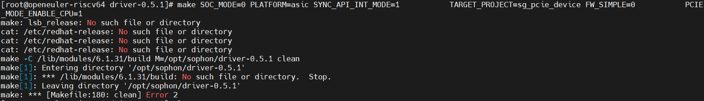
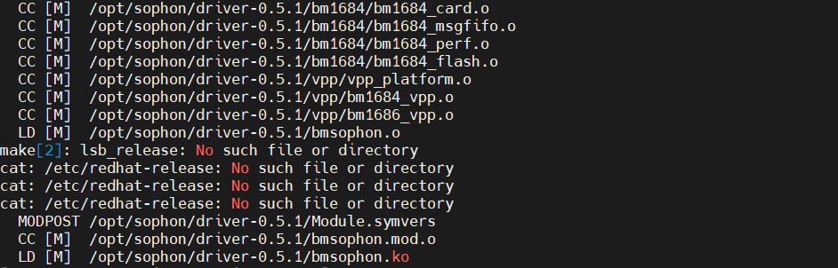

# openEuler 2403编译libsophon驱动问题解决

目标：解决openEuler 2403 riscv编译libsophon驱动失败的问题
注：openEuler 2309未遇到该问题，镜像所在目录：<https://mirror.iscas.ac.cn/openeuler-sig-riscv/openEuler-RISC-V/preview/openEuler-23.09-V1-riscv64/SG2042/>

## 环境说明

- 操作系统：openEuler 2403 riscv（算能提供）
- CPU: SG2042
- 驱动版本：libsophon-0.5.1

## 问题

参考[《libsophon使用手册》](https://doc.sophgo.com/sdk-docs/v24.04.01/docs_latest_release/docs/libsophon/guide/html/1_install.html#linux)安装驱动时出现编译失败问题：

解决：

更新kernel、kernel-devel、kernel-headers RPM软件包，参考《SG2042 Fedora RPM包更新指导手册》，目的是保证三者版本一致

再次尝试安装驱动，成功编译出bmsophon.ko文件

