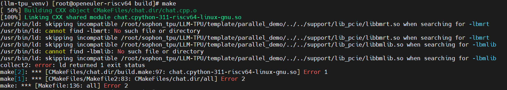
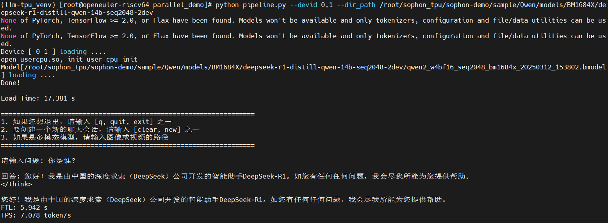
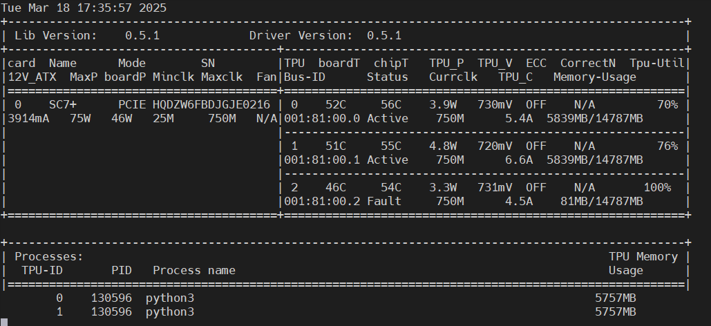

# 运行deepseek-r1-distill-qwen-14b-2dev bmodel

目标：尝试使用TPU运行deepseek-r1-distill-qwen-14b双芯模型推理

## 环境说明

* TPU: riscv pcie mode
* SDK: v24.04.01

## 操作步骤

### 运行14B双芯模型推理

#### 环境准备

安装LLM-TPU相关依赖库

```sh
git clone https://github.com/sophgo/LLM-TPU.git
pip3 install dfss transformers==4.45.1 pybind11[global] Jinja2
```

多芯模型（例如deepseek-r1-distill-qwen-14B），编译c++依赖

```sh
cd template/parallel_demo
mkdir build && cd build
cmake ..
make
cp *cpython* ..
cd ..
```

编译出现问题

```sh
In file included from /root/sophon_tpu/LLM-TPU/template/parallel_demo/../../support/include/utils.h:15,
                 from /root/sophon_tpu/LLM-TPU/template/parallel_demo/chat.cpp:22:
/root/sophon_tpu/LLM-TPU/template/parallel_demo/../../support/include/cnpy.h:35:10: fatal error: zlib.h: No such file or directory
   35 | #include <zlib.h>
      |          ^~~~~~~~
compilation terminated.
make[2]: *** [CMakeFiles/chat.dir/build.make:76: CMakeFiles/chat.dir/chat.cpp.o] Error 1
make[1]: *** [CMakeFiles/Makefile2:83: CMakeFiles/chat.dir/all] Error 2
make: *** [Makefile:136: all] Error 2 
```

缺少`zlib.h`头文件，需要安装zlib-devel

```sh
dnf install zlib-devel
```

确保能找到`zlib`

```sh
export LD_LIBRARY_PATH=/usr/lib64:$LD_LIBRARY_PATH
```

之后又出现新问题



修改CMakeList.txt文件

```sh
cmake_minimum_required(VERSION 3.10)
project(model)

if (NOT DEFINED TARGET_ARCH)
    set(TARGET_ARCH pcie)
endif()

if (NOT DEFINED TYPE)
    set(TYPE "default")
endif()

include_directories(${PROJECT_SOURCE_DIR}/../../support/include)
include_directories(/opt/sophon/libsophon-current/include)

# 查找 zlib 库
find_package(ZLIB REQUIRED)

if (${TARGET_ARCH} STREQUAL "pcie")
    add_definitions(-DPCIE_TARGET)
    #link_directories(${PROJECT_SOURCE_DIR}/../../support/lib_pcie)
    link_directories(/opt/sophon/libsophon-current/lib)
    message("PCIE mode, starting......")
endif()

add_definitions(-DDEBUG --std=c++17 -fPIC -Wall)

set(CMAKE_BUILD_TYPE "Debug")

find_package(pybind11 REQUIRED CONFIG)

file(GLOB CPP_FILES ${PROJECT_SOURCE_DIR}/*.cpp)

pybind11_add_module(chat ${CPP_FILES})
# target_link_libraries(chat PUBLIC bmrt bmlib ${OPENCV_LIBS})
# 链接库，确保链接 zlib
target_link_libraries(chat PUBLIC bmrt bmlib ${ZLIB_LIBRARIES})
# 添加 zlib 头文件路径
target_include_directories(chat PRIVATE ${ZLIB_INCLUDE_DIRS})
install(TARGETS chat DESTINATION python)
```

修改后即可顺利编译出`chat.cpython-311-riscv64-linux-gnu.so`文件

#### 下载模型

```sh
cd parallel_demo
python3 -m dfss --url=open@sophgo.com:/ext_model_information/LLM/LLM-TPU/deepseek-r1-distill-qwen-14b-seq2048-2dev.zip
unzip deepseek-r1-distill-qwen-14b-seq2048-2dev.zip
mv tmp/ deepseek-r1-distill-qwen-14b-seq2048-2dev
```

#### 运行模型

```sh
python3 pipeline.py --devid 0,1 --dir_path ./deepseek-r1-distill-qwen-14b-seq2048-2dev
```

deepseek-r1-distill-qwen-14b 双芯bmodel 运行结果：



运行双芯推理时TPU的利用率及内存占用情况如下



**推理性能**：

TPS：双芯约 7 tokens/s

## 参考资料

* [LLM-TPU: LLM Template](https://github.com/sophgo/LLM-TPU/blob/main/template/README.md)
