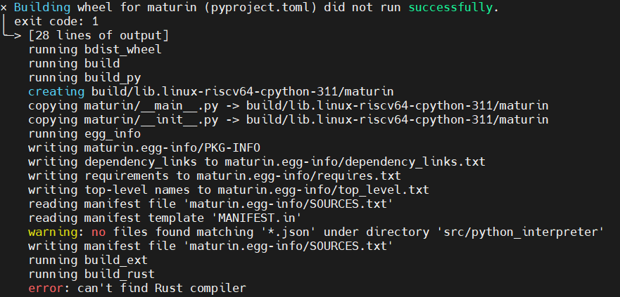
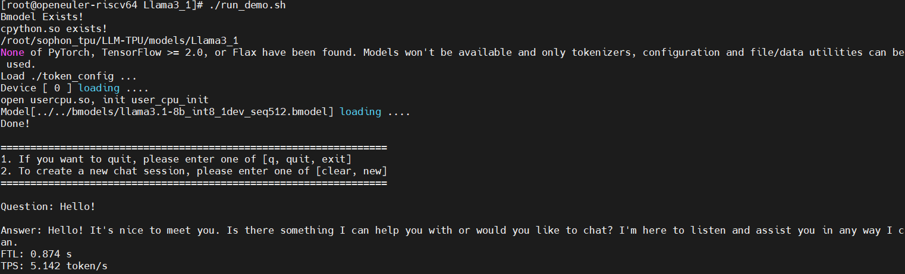

# 运行llama3.1模型推理

目标：在sg2042+tpu环境下运行llama3.1量化模型推理，记录过程中遇到的问题以及解决方案

## 环境说明

* CPU: sg2042
* TPU: SC7 HP75
* Chip: BM1684X
* OS: oe2403 riscv
* Driver: libsophon_0.5.1

注：将x86 docker环境中编译出的bmodel文件复制到sg2042的LLM-TPU/bmodel/目录下，需要确保其与run_demo.sh脚本中的`llama3.1-8b_int8_1dev_seq512.bmodel`文件名保持一致

## 运行推理

```sh
cd LLM-TPU/models/Llama3.1/
./run_demo.sh
```

或参考脚本内容手动操作

## 问题解决

以下问题按顺序出现，依次解决

**问题**：

未找到pybind11配置文件


解决：

安装pybind11

```sh
pip install pybind11
```

重新生成仍出现该问题

修改CMakeList.txt文件内容

添加内容

```cmake
# 指定 pybind11 的路径
set(pybind11_DIR "/usr/local/lib/python3.11/site-packages/pybind11/share/cmake/pybind11")
```

随后`cmake ..`运行成功

重新编译时又遇到问题

**问题**：


表示缺少 Python 开发头文件。Python.h 是 Python C API 的一部分，通常在安装 Python 开发包时会提供。

解决：

安装Python开发包

```sh
dnf install python3-devel
```

**问题**：


提示未找到 bmruntime_interface.h 头文件

解决：

```sh
find / -name bmruntime_interface.h
/opt/sophon/libsophon-0.5.1/include/bmruntime_interface.h
```

找到 bmruntime_interface.h 文件，并且它位于 /opt/sophon/libsophon-0.5.1/include/ 路径下，你需要将这个路径添加到 CMakeLists.txt 中，以便编译器能够找到它。

修改CMakeList.txt文件

```cmake
include_directories(${PROJECT_SOURCE_DIR}/../support/include /opt/sophon/libsophon-0.5.1/include/)
```

**问题**：


表示链接器无法找到 bmrt 和 bmlib 这两个库文件

解决：

确定库文件存在

```sh
find / -name "libbmrt*"
find / -name "libbmlib*"
```

发现可以找到库文件，并且它们位于 /opt/sophon/libsophon-0.5.1/lib/ 目录下，接下来你需要将该目录添加到 CMake 配置中，确保链接器能够找到这些库文件。

修改CMakeList.txt文件内容

```cmake
# 添加库文件搜索路径
link_directories(/opt/sophon/libsophon-0.5.1/lib)
```

随后可成功编译


**问题**：

运行 run_demo.sh 出现问题


解决：

安装transformers

```sh
pip install transformers
```

出现两个**问题**：


解决：

```sh
pip install ninja
dnf install autoconf automake libtool
```

**问题**：

缺少Rust编译器问题



这个错误是因为你在安装 maturin 时，构建过程中需要使用 Rust 编译器（Rust 是一个系统编程语言，用于编写高效的本地扩展模块），但是系统没有安装 Rust 编译器。

解决：

安装Rust编译器

```sh
curl --proto '=https' --tlsv1.2 -sSf https://sh.rustup.rs | sh
# 配置 Rust 环境
source $HOME/.cargo/env
```

验证安装

```sh
rustc --version

rustc 1.85.0 (4d91de4e4 2025-02-17)
```

安装成功

再次尝试安装 transformers 发现可以安装成功

**问题**：

运行推理./run_demo.sh，输入问题内容后出现以下


解决：

```sh
pip install jinja2
```

再次尝试运行推理



成功运行！

## 结论

成功在sg2042+tpu环境下运行llama3.1量化模型推理
