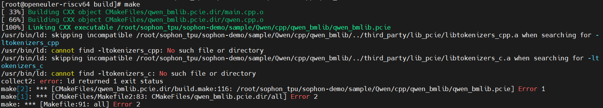
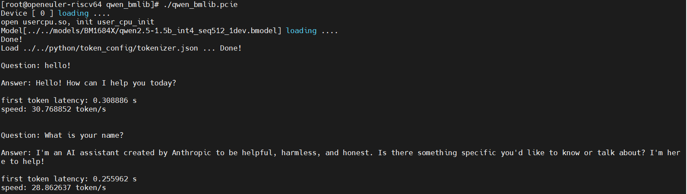

# Qwen模型CPP例程

目标：在sg2042+TPU环境下运行Qwen量化模型推理的CPP例程

## 环境准备 - riscv PCIe平台

需要安装libsophon，具体步骤参考[riscv-pcie平台的开发和运行环境搭建](./environment_install_guide.md)

## 程序编译

C++程序运行前需要编译可执行文件。

### 下载第三方库

```sh
cd Qwen/cpp
pip3 install dfss -i https://pypi.tuna.tsinghua.edu.cn/simple --upgrade
python3 -m dfss --url=open@sophgo.com:sophon-demo/Qwen/cpp/third_party.zip
unzip third_party.zip
rm -f third_party.zip
```

但是无法使用这里的.so文件，直接使用编译提示不兼容，原因是库文件架构与当前系统不兼容，链接器自动跳过该库文件



### 编译Tokenizer

* 下载源码

```sh
git clone https://github.com/mlc-ai/tokenizers-cpp
cd tokenizers-cpp
```

* 升级RUST编译工具包

```sh
export RUSTUP_DIST_SERVER="https://rsproxy.cn"
export RUSTUP_UPDATE_ROOT="https://rsproxy.cn/rustup"
curl --proto '=https' --tlsv1.2 -sSf https://rsproxy.cn/rustup-init.sh | sh
```

* 直接在目标平台编译

```sh
mkdir build && cd build
cmake ..
make
```

拷贝静态库和头文件`libtokenizers_c.a`、`libtokenizers_cpp.a`、`sentencepiece/src/libsentencepiece.a`到`third_party/lib_pcie`工作目录，即可

```sh
cp libtokenizers_c.a libtokenizers_cpp.a sentencepiece/src/libsentencepiece.a  ../../third_party/lib_pcie/
```

### 在PCIe平台上编译程序

```sh
cd qwen_bmlib
mkdir build && cd build
cmake ..
make
cd ..
```

编译完成后，会在qwen_bmlib目录下生成qwen_bmlib.pcie。

## 推理测试

对于PCIe平台，可以直接在PCIe平台上推理测试

### 参数说明

可执行程序默认有一套参数，请注意根据实际情况进行传参，以qwen_bmlib.pcie为例，具体参数说明如下：

```sh
Usage: qwen_bmlib.pcie [params]

  --help                  : Show help info.
  --bmodel_path           : Set bmodel path 
  --tokenizer_path        : Set tokenizer path 
  --dev_id                : Set devices to run for model, e.g. 1,2, if not provided, use 0
```

>注意： cpp例程传参与python不同，需要用等于号，例如./qwen_bmlib.pcie --bmodel_path=xxx。

### 测试

需要在`cpp/qwen_bmlib`目录下执行程序，测试实例如下。

```sh
./qwen_bmlib.pcie
```

运行结果



## 参考资料

* [sophon-demo Qwen C++例程](https://github.com/sophgo/sophon-demo/tree/release/sample/Qwen/cpp)
