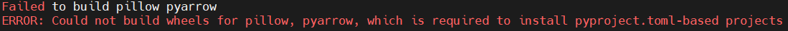
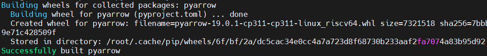
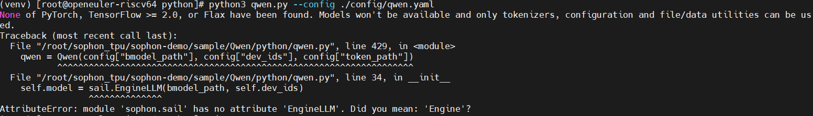
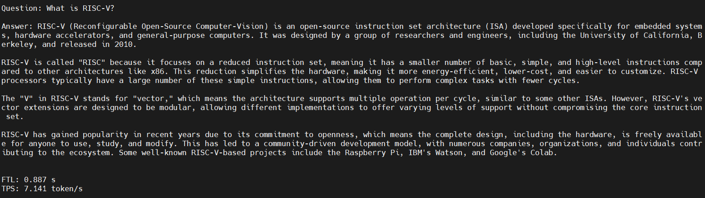
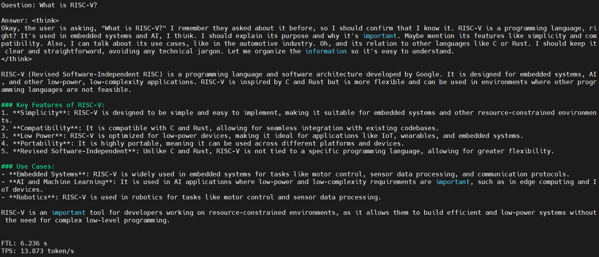
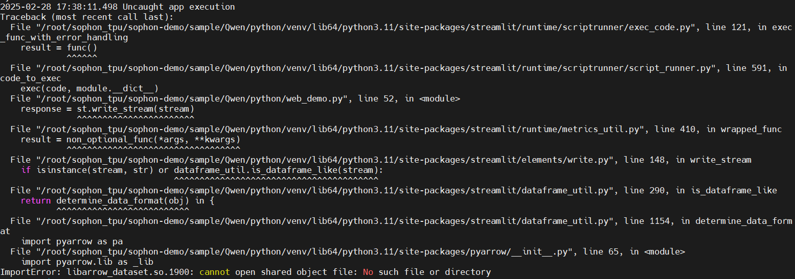
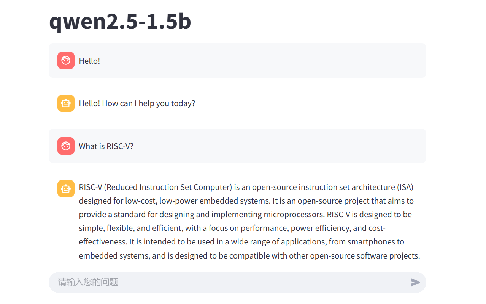
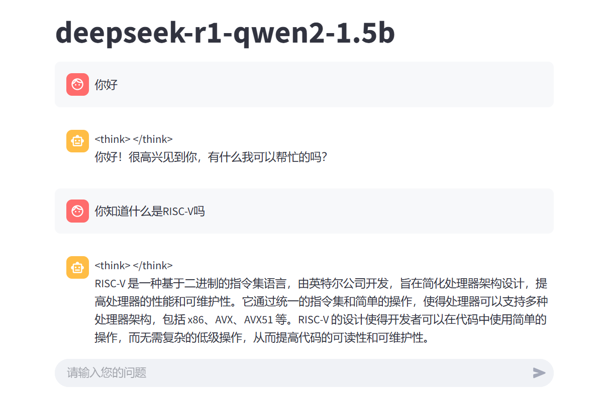
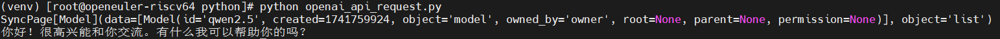
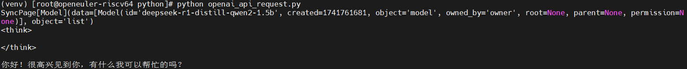

# 运行SOPHON-DEMO中的Qwen模型推理

目标：在sg2042+TPU环境下运行Qwen和deepseek-r1量化模型推理

## 环境准备

### 准备模型

**使用提供的模型：**

​本例程在`scripts`目录下提供了下载脚本`download.sh`

```bash
# qwen 1684x
./scripts/download.sh qwen
# qwen1.5 1684x
./scripts/download.sh qwen1.5
# qwen2 1684x
./scripts/download.sh qwen2
# qwen2.5 1684x
./scripts/download.sh qwen2.5
# deepseek-r1-distill-qwen2
./scripts/download.sh deepseek-r1-distill-qwen2
```

**自行编译模型：**

参考：[Qwen模型导出与编译](./build_qwen_bmodel_guide.md)

### 安装依赖

创建虚拟环境

```sh
python -m venv --system-site-packages venv
source venv/bin/activate
```

然后安装依赖

```sh
pip3 install -r python/requirements.txt
```

遇到问题：



pillow和pyarrow两个软件包安装失败，这是streamlit安装时依赖的两个包，可以临时排除streamlit安装其他的包

>注：streamlit安装失败，不影响后续命令行推理方式，但Web demo无法使用

解决：指定安装arrow 19.0.0版本

```sh
wget https://github.com/apache/arrow/archive/refs/tags/apache-arrow-19.0.0.tar.gz
tar -zxvf apache-arrow-19.0.0.tar.gz
cd arrow/cpp
mkdir build && cd build
cmake .. --preset ninja-debug-minimal -DCMAKE_INSTALL_PREFIX=/usr/local -DARROW_PARQUET=ON -DARROW_CSV=ON -DARROW_COMPUTE=ON -DARROW_DATASET=ON -DARROW_FILESYSTEM=ON -DARROW_HDFS=ON -DARROW_JSON=ON
```

ninja编译安装

```sh
ninja -j$(nproc)
ninja install
```

随后`pip install pyarrow`即可安装成功



pillow可通过预构建的轮子来安装

### 更新sophon-sail

另外需要安装sophon-sail，由于本例程需要的sophon-sail版本较新，相关功能还未发布，这里暂时提供一个可用的sophon-sail源码，x86/arm/riscv PCIe环境可以通过下面的命令下载：

```sh
pip3 install dfss --upgrade # 安装dfss依赖
python3 -m dfss --url=open@sophgo.com:sophon-demo/Qwen/sophon-sail.tar.gz
tar xvf sophon-sail.tar.gz
```

参考[sophon-sail编译安装指南 --> .典型编译方式二](https://doc.sophgo.com/sdk-docs/v24.04.01/docs_latest_release/docs/sophon-sail/docs/zh/html/1_build.html#id8)在x86主机上交叉编译不包含bmcv,sophon-ffmpeg,sophon-opencv的可被Python3接口调用的Wheel文件。

如未修改sophon-sail版本，会出现以下问题：



## 推理测试

python例程不需要编译，可以直接运行，PCIe平台和SoC平台的测试参数和运行方式是相同的。

### 参数说明

qwen.py使用config/qwen.yaml配置文件进行参数配置。

qwen.yaml内容如下

```yaml
bmodel_path: ../models/BM1684X/qwen1.5-7b_int4_seq512_1dev.bmodel   ## 用于推理的bmodel路径
token_path: ./token_config    ## tokenizer目录路径；
dev_ids: 0   ## 用于推理的tpu设备id；
```

### 使用方式

```sh
cd python
python3 qwen.py --config ./config/qwen.yaml
```

在读入模型后会显示"Question:"，然后输入就可以了。模型的回答会出现在"Answer"中。结束对话请输入"exit"。

**注意：**

>用户应根据需要自己选择或创建相应的配置文件，并正确填写配置文件中的参数(以下为特殊事例)。
如果要加载deepseek-r1-distill-qwen2模型(BM1684X)，那么请将--config参数修改为 ./config/deepseek-r1-distill-qwen2.yaml

qwen1.5-7b_int4_seq512_1dev.bmodel 运行结果：



每秒token数约为7.1

deepseek-r1-distill-qwen2-1.5b_w4bf16_seq8192.bmodel 运行结果：



每秒token数约为13.9

## Web Demo

提供了基于streamlit的web demo。

### 参数说明

web_demo.py使用config/web.yaml配置文件进行参数配置。

web.yaml内容如下

```yaml
title: qwen1.5-7b  ## 标题
bmodel_path: ../models/BM1684X/qwen1.5-7b_int4_seq512_1dev.bmodel  ## 用于推理的bmodel路径；
token_path: ./token_config   ## tokenizer目录路径；
dev_ids: 0   ## 用于推理的tpu设备id；
```

### 使用方式

首先安装第三方库

```sh
pip3 install -r python/requirements.txt
```

然后通过streamlit运行web_demo.py即可运行一个web_server

```sh
cd python
python3 -m streamlit run web_demo.py -- --config=./config/web.yaml
```

首次运行需要输入邮箱，输入邮箱后命令行输出以下信息则表示启动成功（**Note:** 直接运行成功，并未发现要输入邮箱）

```sh
You can now view your Streamlit app in your browser.

Local URL: http://localhost:8501
Network URL: http://192.168.20.93:8501
External URL: http://183.47.95.48:8501 # 不可用
```

在浏览器中打开输出的地址即可使用，web页面如下，在底部对话框中输入问题。

输入问题内容后，出现问题：



这个错误表明 Python 在尝试加载 libarrow_dataset.so.1900 共享库时失败

解决：确认文件是否存在

```sh
[root@openeuler-riscv64 ~]# find / -name "libarrow_dataset.so.1900" 2>/dev/null
/usr/local/lib64/libarrow_dataset.so.1900
```

找到该文件，表明系统在运行时未能正确加载该共享库。这是因为系统的动态链接库路径（LD_LIBRARY_PATH）没有包含该库所在的目录。

在~/.bashrc文件末尾添加以下内容：

```sh
export LD_LIBRARY_PATH=/usr/local/lib64:$LD_LIBRARY_PATH
```

使配置生效

```sh
source ~/.bashrc
```

重新运行Web demo问题解决

Web界面



每秒token数约为17.5



每秒token数约为13.4

## Openai API接口服务

基于openai api 接口server。

### 参数说明

openai_api_server.py使用config/api.yaml配置文件进行参数配置。

api.yaml内容如下

```yaml
models:                 ## 模型列表
  - name: qwen1.5       ## 模型名称，用于匹配模型
    bmodel_path: ../models/BM1684X/qwen1.5-7b_int4_seq512_1dev.bmodel ## 用于推理的bmodel路径
    token_path: ./token_config ## tokenizer目录路径
    dev_id: 0  ## 用于推理的tpu设备id

port: 18080   ## 服务端口
```

### 使用方式

首先安装第三方库

```sh
pip3 install -r python/requirements.txt
```

运行服务

```sh
cd python
python3 openai_api_server.py --config ./config/api.yaml
```

这样我们成功启动了openai api接口服务，可以使用openai的python库进行调用

```sh
python3 openai_api_request.py
```

Qwen2.5-1.5b 运行结果



deepseek-r1-distill-qwen2-1.5b 运行结果



## 参考资料

* [Qwen Python例程](https://github.com/sophgo/sophon-demo/blob/release/sample/Qwen/python/README.md)
