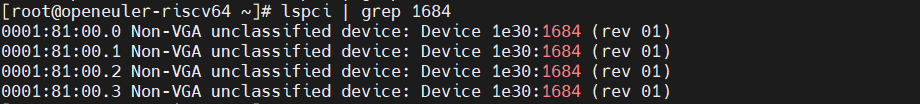
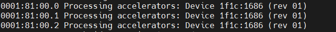
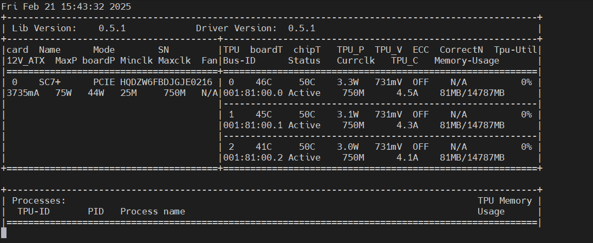
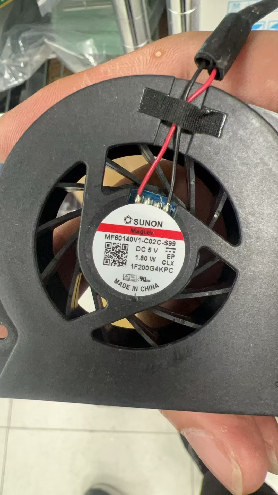

# 安装SC7 HP75 TPU

## 环境说明

* 主板：Milk-v pioneer
* CPU: sg2042
* TPU: SC7 HP75
* OS: openEuler riscv
* 模式：riscv pcie

## 硬件安装

关机将SC7 HP75插入PCIE插槽后，重启亮绿灯

使用以下命令查看设备:

```shell
lspci | grep 1684
```

显示输出：



**问题1**：未安装驱动时安装卡，一段时间后智算卡温度很高，考虑是未安装驱动或风量不够所导致，倾向前者

解决：尝试安装驱动

实际安装驱动并不能解决该TPU卡过热问题，单纯是风量不够需要加装风扇才行

**说明**：上述设备显示有问题，修改硬件之后lspci显示的设备信息如下：



## 安装驱动

### 安装过程

如果有旧版本，先参考下面的卸载方式步骤卸载旧版本。

```sh
tar -xzvf libsophon_0.5.1_riscv64.tar.gz
sudo cp -r libsophon_0.5.1_riscv64/* /
sudo ln -s /opt/sophon/libsophon-0.5.1 /opt/sophon/libsophon-current
```

接下来请先按照您所使用Linux发行版的要求搭建驱动编译环境，然后做如下操作：

```sh
sudo ln -s /opt/sophon/driver-0.5.1/a53lite_pkg.bin /lib/firmware/bm1684x_firmware.bin
cd /opt/sophon/driver-0.5.1
```

之后就可以编译驱动了（这里不依赖于dkms）：

```sh
sudo make SOC_MODE=0 PLATFORM=asic SYNC_API_INT_MODE=1 \
          TARGET_PROJECT=sg_pcie_device FW_SIMPLE=0 \
          PCIE_MODE_ENABLE_CPU=1
sudo cp ./bmsophon.ko /lib/modules/$(uname -r)/kernel/
sudo depmod # 生成模块依赖关系，确保内核模块正确加载
sudo modprobe bmsophon # 加载模块及其依赖项
```

最后是一些配置工作：

```sh
# 添加库和可执行文件路径：
sudo cp /opt/sophon/libsophon-current/data/libsophon.conf /etc/ld.so.conf.d/
sudo ldconfig
sudo cp /opt/sophon/libsophon-current/data/libsophon-bin-path.sh /etc/profile.d/
# 在终端执行如下命令，或者登出再登入当前用户后即可使用bm-smi等命令：
source /etc/profile

# 添加cmake config文件：
sudo mkdir -p /usr/lib/cmake/libsophon
sudo cp /opt/sophon/libsophon-current/data/libsophon-config.cmake /usr/lib/cmake/libsophon/
```

### 自动加载

由于该驱动重启并不会自动加载，因此需要配置自动加载模块

创建 `modules-load.d` 配置文件

```sh
sudo vim /etc/modules-load.d/bmsophon.conf
```

添加以下内容

```vim
bmsophon
```

重启验证，使用以下命令查看模块是否被加载

```sh
lsmod | grep bmsophon
```

### 卸载方式

```sh
sudo rm -f /etc/ld.so.conf.d/libsophon.conf
sudo ldconfig
sudo rm -f /etc/profile.d/libsophon-bin-path.sh
sudo rm -rf /usr/lib/cmake/libsophon
sudo rmmod bmsophon
sudo rm -f /lib/modules/$(uname -r)/kernel/bmsophon.ko
sudo depmod
sudo rm -f /lib/firmware/bm1684x_firmware.bin
sudo rm -f /lib/firmware/bm1684_ddr_firmware.bin
sudo rm -f /lib/firmware/bm1684_tcm_firmware.bin
sudo rm -f /opt/sophon/libsophon-current
sudo rm -rf /opt/sophon/libsophon-0.5.1
sudo rm -rf /opt/sophon/driver-0.5.1
```

### bm-smi

bm-smi运行结果：

```sh
[root@openeuler-riscv64 ~]# bm-smi
bm-smi: /usr/lib64/libncurses.so.6: no version information available (required by bm-smi)
bm-smi: /usr/lib64/libtinfo.so.6: no version information available (required by bm-smi)
get devcount failed!
no sophon device found on this PC or Server
: No such file or directory
```

代表未检测到硬件

如果显示以下信息：



代表硬件及驱动安装正常

## 12.24 安装记录

安装SC7 HP75卡后，发现指示灯未亮，更换PCIE插槽后发现是原PCIE插槽没电（坏了？原因很有可能是第一次试的时候坏的，因为当时那张卡没坏但是也不亮了）；

更换PCIE插槽后卡的指示灯可以亮，但是重启之后发现无法启动系统，询问算能后得到信息是插上这张卡会影响系统启动，需要根据其手册上的步骤操作。（**安装TPU时有限制：需要AMD显卡在内侧（即靠近CPU侧），TPU卡在外侧**）

另外一个问题就是需要一个散热风扇以满足卡的散热要求



沟通后由算能那边提供一个风扇
