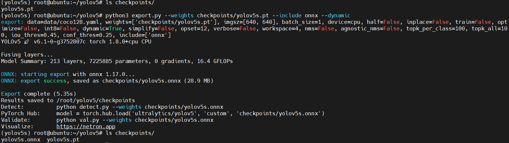

# yolov5 onnx模型导出

目标：在x86环境下导出yolov5 onnx模型便于后续转换得到bmodel

## 环境说明

* OS: Ubuntu20.04 x86
* miniconda虚拟环境管理

## 操作步骤

### 环境搭建

以下在虚拟环境中进行

```sh
conda create -n yolov5 python=3.9
conda activate yolov5
```

下载源码

```sh
git clone https://github.com/ultralytics/yolov5  # clone
cd yolov5
# 切换分支
git checkout v6.1
```

安装依赖

由于后续推荐torch版本为1.8.0+cpu，从而避免因pytorch版本导致模型编译失败问题
因此首先安装torch，随后再安装其余依赖

```sh
# CPU only
pip install torch==1.8.0+cpu torchvision==0.9.0+cpu torchaudio==0.8.0 -f https://download.pytorch.org/whl/torch_stable.html
pip install -r requirements.txt  # install
pip install onnx
```

下载预训练模型

```sh
mkdir checkpoints && cd checkpoints/
wget https://github.com/ultralytics/yolov5/releases/download/v7.0/yolov5s.pt
```

导出onnx模型

参考算能YOLOv5模型导出指导修改源代码，然后导出模型

```sh
python3 export.py --weights checkpoints/yolov5s.pt --include onnx --dynamic
```

>**注意**：遇到numpy版本不匹配问题，最终通过安装 numpy-1.23.0 解决，也有可能不会出现该问题



转换成功，脚本在原始pt模型所在目录生成导出的onnx模型，导出后可以修改模型名称以区分不同版本和输出类型，如yolov5s_v6.1_3output.onnx表示带有3个输出的onnx模型。

## 参考资料

* [sophon-demo: YOLOv5模型导出](https://github.com/sophgo/sophon-demo/blob/release/sample/YOLOv5/docs/YOLOv5_Export_Guide.md)
* [YOLOv5 official repo](https://github.com/ultralytics/yolov5/tree/v6.1)
